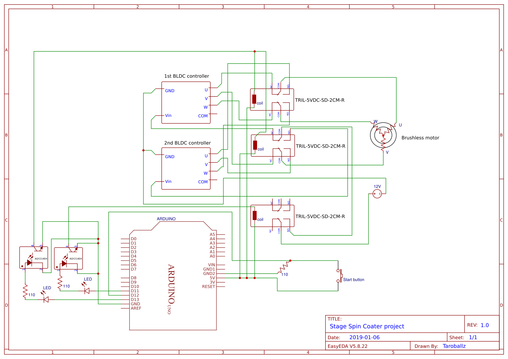

# Stage Spin Coater
# Material
* Segate HDD x1
* BLDC motor controller x2
* 12V powersupply x1
* AQY214EH Opto-isolator x2
* TRIL-5VDC-SD-2CM-R solid relay x3
* LED x2
* BreadBoard x1
* Button x1
* Arduino UNO x1
* 110 ohm resistor x3
# Schematic

# Video
